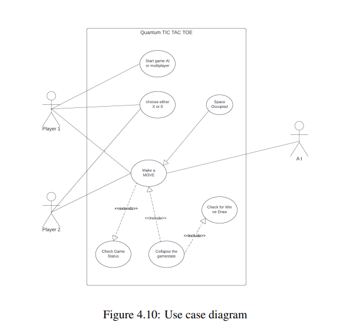
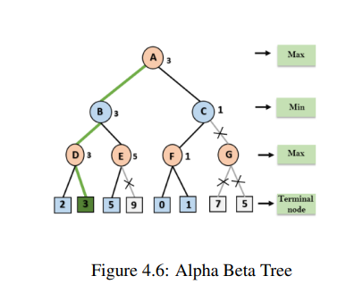
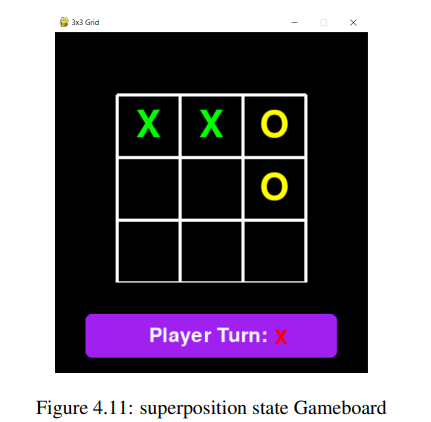
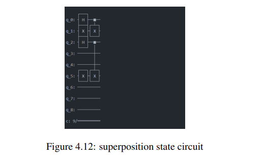
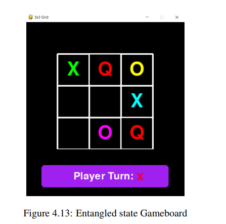
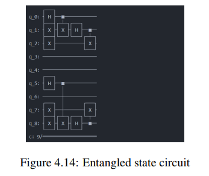

# Quantum Tic-Tac-Toe

Welcome to the **Quantum Tic-Tac-Toe** repository! This project is a quantum-inspired version of the classic Tic-Tac-Toe game, built using **Qiskit** for quantum computing, **Pygame** for the graphical user interface (GUI), and **Alpha-Beta Pruning** for the AI opponent. The game introduces quantum mechanics concepts such as **superposition**, **entanglement**, and **collapse** to create a unique gaming experience that’s both fun and educational.

---

## Table of Contents
- [Introduction](#introduction)
- [Team Members](#team-members)
- [System Design](#system-design)
- [Use Case Diagram](#use-case-diagram)
- [Alpha-Beta Pruning Algorithm](#alpha-beta-pruning-algorithm)
- [Mathematical Formulation](#mathematical-formulation)
- [Gameplay and Quantum Circuit Implementation](#gameplay-and-quantum-circuit-implementation)
- [How to Run the Game](#how-to-run-the-game)
- [Future Enhancements](#future-enhancements)
- [References](#references)

---

## Introduction
Quantum Tic-Tac-Toe is a variant of the classic game that incorporates principles of quantum mechanics, such as superposition and entanglement. The game is designed to provide players with an intuitive understanding of quantum concepts while offering a strategic and fun gaming experience. 

The game is implemented using:
- **Qiskit**: For simulating quantum circuits and operations.
- **Pygame**: For creating the graphical user interface (GUI).
- **Alpha-Beta Pruning**: For the AI opponent, which uses quantum strategies to make decisions.

This project was developed as part of a minor project at **Tribhuvan University, Institute of Engineering, Purwanchal Campus**.

---

## Team Members
This project was developed by the following team members:
- [**Kritika Thapa**] - [PUR077BCT041]
- [**Prashant Bhattarai**](https://github.com/IamPrashantBhattarai) - [PUR077BCT059]
- [**Roshan Chaudhary**](https://github.com/Roshanchau) - [PUR077BCT069]
- [**Saurab Baral**](https://github.com/Twtamaris) - [PUR077BCT075]
---

## System Design
The system design of the Quantum Tic-Tac-Toe game involves a hybrid approach, combining classical and quantum computing. The game is built using Python, with Qiskit for quantum simulation and Pygame for the graphical interface.

### System Design Diagram


---

## Use Case Diagram
The following diagram outlines the interactions between the players and the system, including the AI opponent:


---

## Alpha-Beta Pruning Algorithm
**Alpha-Beta Pruning** is an optimization technique for the Minimax algorithm, used in decision-making for the AI player. It reduces the number of nodes evaluated in the search tree by pruning branches that cannot influence the final decision.

### Key Concepts:
- **Alpha**: The best value that the maximizer (AI) can guarantee.
- **Beta**: The best value that the minimizer (player) can guarantee.
- **Pruning**: Eliminating branches that do not affect the final decision.

### Algorithm Steps:
1. **Max-Value Function**: Evaluates the best move for the AI (maximizer).
2. **Min-Value Function**: Evaluates the best move for the player (minimizer).
3. **Pruning**: If a move is found to be worse than the current best, the branch is pruned.



---

## Mathematical Formulation
Each tile on the board is represented by a qutrit (quantum trit), which can be in a superposition of states |0⟩, |1⟩, or |2⟩.

### Gates Used:
## 1. Hadamard Gate

- **Creates superposition**:

  \[
  U_H|0\rangle = \frac{1}{\sqrt{2}}(|0\rangle + |1\rangle), \quad U_H|1\rangle = \frac{1}{\sqrt{2}}(|0\rangle - |1\rangle)
  \]

- **Matrix representation**:

  \[
  U_H = \frac{1}{\sqrt{2}} \begin{pmatrix} 1 & 1 \\ 1 & -1 \end{pmatrix}
  \]

## 2. CNOT Gate

- **Entangles two qubits**:

  \[
  U_{CNOT} = \begin{pmatrix} 1 & 0 & 0 & 0 \\ 0 & 1 & 0 & 0 \\ 0 & 0 & 0 & 1 \\ 0 & 0 & 1 & 0 \end{pmatrix}
  \]

## 3. Pauli X Gate

- **Flips the state of a qubit**:

  \[
  X = \begin{pmatrix} 0 & 1 \\ 1 & 0 \end{pmatrix}
  \]

---

## Gameplay and Quantum Circuit Implementation
### Superposition Step
- Players can place an X or O in multiple positions simultaneously using the Hadamard gate.



### Entanglement Step
- Players can entangle two tiles using the CNOT gate, creating a correlation between the states of the tiles.


### Collapse Step
- The superposition is reduced to a single classical state, either |0⟩ or |1⟩, with a 50% probability.


---

## How to Run the Game
1. **Clone the repository**:
   ```bash
   git clone https://github.com/Twtamaris/quantum_tic_tac_toe.git
   ```
2. **Install dependencies**:
   ```bash
   pip install qiskit pygame
   ```
3. **Run the game**:
   ```bash
   python app.py
   ```

---

## Future Enhancements
1. **Integration of Additional Quantum Gates**: Introduce gates like the T and S gates for added complexity.
2. **Advanced AI Algorithms**: Develop more sophisticated quantum AI algorithms.
3. **Multiplayer Support**: Allow real-time multiplayer functionality.
4. **Visual Enhancements**: Improve graphics and animations for a more immersive experience.

---

## References
1. A. Goff, "Quantum tic-tac-toe: A teaching metaphor for superposition in quantum mechanics," *American Journal of Physics*, 2006.
2. S. Sagole et al., "Quantum tic-tac-toe: A hybrid of quantum and classical computing," 2019.
3. M. N. Jamil, "Quantum tic tac toe," 2023.

---

Enjoy playing Quantum Tic-Tac-Toe and exploring the fascinating world of quantum mechanics through this unique game! 🎮
